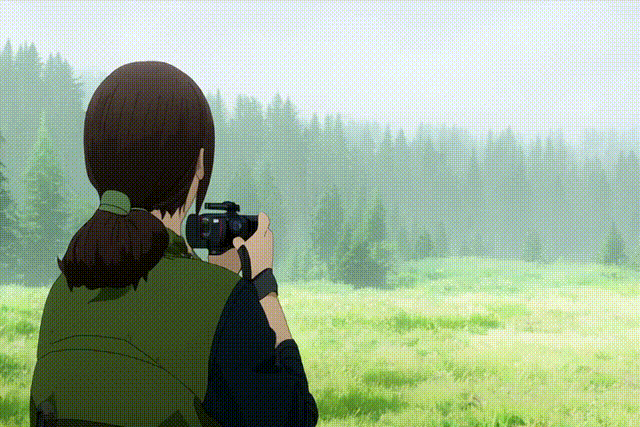
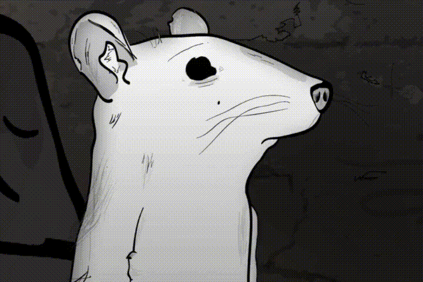

# Mask&sup2;DiT: Dual Mask-based Diffusion Transformer for Multi-Scene Long Video Generation (CVPR 2025)

<div align="center">
 <a href='http://arxiv.org/abs/2503.19881'></a> &nbsp;&nbsp;&nbsp;&nbsp;&nbsp;
 <a href='https://tianhao-qi.github.io/Mask2DiTProject/'></a> &nbsp;&nbsp;&nbsp;&nbsp;&nbsp;
 <a href='https://huggingface.co/qth/Mask2DiT'>
  
</a>

_**[Tianhao Qi*](https://tianhao-qi.github.io/), [Jianlong Yuan✝](https://scholar.google.com.tw/citations?user=vYe1uCQAAAAJ&hl=zh-CN), [Wanquan Feng](https://wanquanf.github.io/), [Shancheng Fang✉](https://scholar.google.com/citations?user=8Efply8AAAAJ&hl=zh-CN), [Jiawei Liu](https://scholar.google.com/citations?user=X21Fz-EAAAAJ&hl=en&authuser=1), <br>[SiYu Zhou](https://openreview.net/profile?id=~SiYu_Zhou3), [Qian He](https://scholar.google.com/citations?view_op=list_works&hl=zh-CN&authuser=1&user=9rWWCgUAAAAJ), [Hongtao Xie](https://imcc.ustc.edu.cn/_upload/tpl/0d/13/3347/template3347/xiehongtao.html), [Yongdong Zhang](https://scholar.google.com.hk/citations?user=hxGs4ukAAAAJ&hl=zh-CN)**_
<br><br>
(*Works done during the internship at Bytedance Intelligent Creation, ✝Project lead, ✉Corresponding author)

From University of Science and Technology of China, ByteDance Intelligent Creation and Yuanshi Inc.

</div>

## 🔆 Introduction

**TL;DR:** We present **Mask²DiT**, a novel dual-mask-based diffusion transformer designed for multi-scene long video generation. It enables both **synthesizing a fixed number of scenes** and **auto-regressively expanding new scenes**, advancing the scalability and continuity of long video synthesis. <br>

### ⭐⭐ Fixed-Scene Video Generation.

<div align="center">

<p> Videos generated with a <b>fixed number of scenes</b> using Mask²DiT.<br> Each scene maintains coherent appearance and motion across temporal boundaries. </p> </div>

### ⭐⭐ Auto-Regressive Scene Expansion.

<div align="center">

<p> Mask²DiT <b>extends multi-scene narratives</b> auto-regressively,<br> producing long and coherent videos with evolving context. </p> </div>

## 📝 Changelog
- __[2025.10.15]__: 🔥🔥 Release the code and checkpoint.
- __[2025.03.26]__: 🔥🔥 Release the arxiv paper and project page.

## 🧩 Inference

We provide two inference pipelines for long video generation:
- 🎬 Fixed-Scene Generation — generate videos with a fixed number of scenes.
- 🔄 Auto-Regressive Scene Expansion — expand scenes continuously based on previous context.

---

### 1️⃣ Prepare Pretrained Model

Download the pretrained model from [Hugging Face](https://huggingface.co/qth/Mask2DiT/tree/main) and place it under:
```
./models/
```

### 2️⃣ Environment Setup

We recommend using a virtual environment to install the required dependencies. You can create a virtual environment using `conda` as follows:
```bash
conda create -n mask2dit python=3.11.2
conda activate mask2dit
pip install torch==2.4.1 torchvision==0.19.1 torchaudio==2.4.1 --index-url https://download.pytorch.org/whl/cu124
pip install -r requirements.txt
```

---

### 🎬 Fixed-Scene Video Generation

Use this script to synthesize videos with a fixed number of scenes:
```python3
python examples/cogvideox_fun/predict_multi_scene_t2v_mask2dit.py
```

#### 📦 Output:

Generated multi-scene video will be saved under samples/mask2dit-cogvideox-5b-multi-scene-t2v.

---

### 🔄 Auto-Regressive Scene Expansion

Use this script to expand video scenes sequentially based on the given context.
```python3
python examples/cogvideox_fun/predict_autoregressive_scene_expansion_mask2dit.py
```

#### 📦 Output:

This mode auto-regressively extends the video while maintaining global temporal consistency, storing the expanded video under samples/mask2dit-cogvideox-5b-autoregressive-scene-expansion.

## 🧑‍🏫 Training

### 1️⃣ Prepare Training Data

Please prepare your datasets following the provided examples:
- [datasets/pretrain.csv](datasets/pretrain.csv) → used for pretraining
- [datasets/sft.json](datasets/sft.json) → used for supervised fine-tuning (SFT)

💡 You can modify these template files to fit your own dataset paths and captions.

### 2️⃣ Pretraining

We pretrain Mask²DiT using the provided [datasets/pretrain.csv](datasets/pretrain.csv). Use the following script to start pretraining:
```bash
bash scripts/cogvideox_fun/train_mask2dit_pretrain.sh
```

### 3️⃣ Supervised Fine-Tuning (SFT)

After pretraining, we fine-tune Mask²DiT using the [datasets/sft.json](datasets/sft.json). Use the following script to start SFT:
```bash
bash scripts/cogvideox_fun/train_mask2dit_sft.sh
```

## 🙏 Acknowledgement

This project is built upon the open-source repository 
[VideoX-Fun](https://github.com/aigc-apps/VideoX-Fun).  
We sincerely thank the original authors for their excellent work and open-source contributions.

## Bibtex
If you find our work useful for your research, welcome to cite our work using the following BibTeX:
```bibtex
@inproceedings{qi2025mask,
  title={Mask\^{} 2DiT: Dual Mask-based Diffusion Transformer for Multi-Scene Long Video Generation},
  author={Qi, Tianhao and Yuan, Jianlong and Feng, Wanquan and Fang, Shancheng and Liu, Jiawei and Zhou, SiYu and He, Qian and Xie, Hongtao and Zhang, Yongdong},
  booktitle={Proceedings of the Computer Vision and Pattern Recognition Conference},
  pages={18837--18846},
  year={2025}
}
```